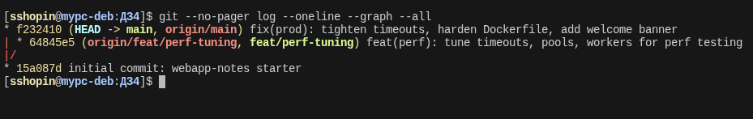
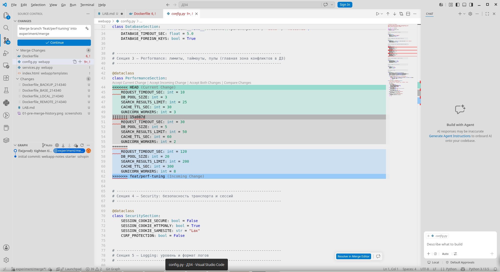
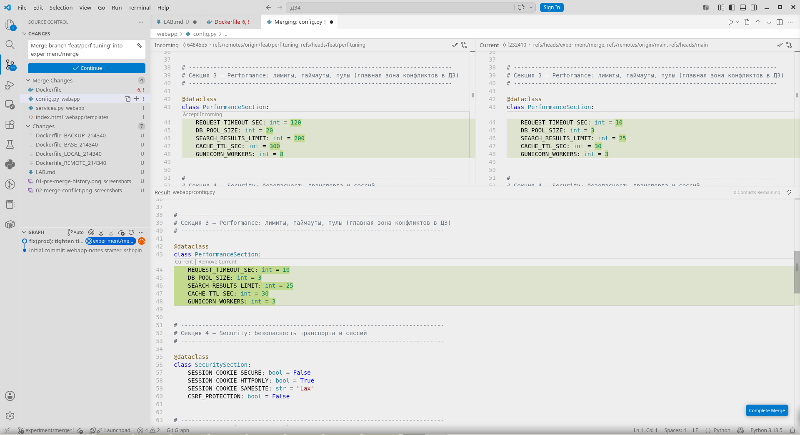
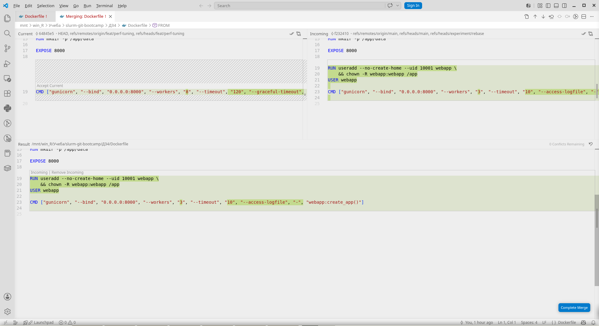
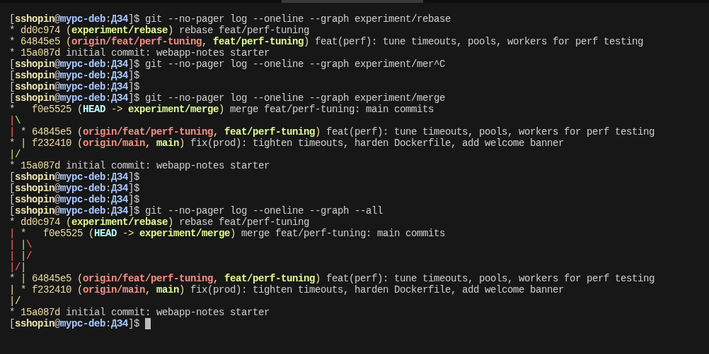
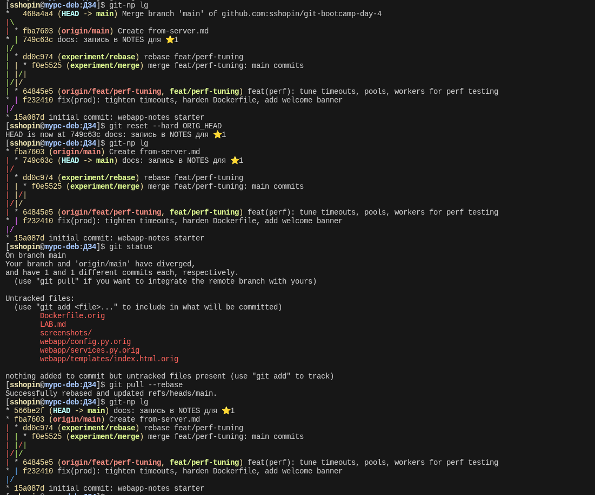
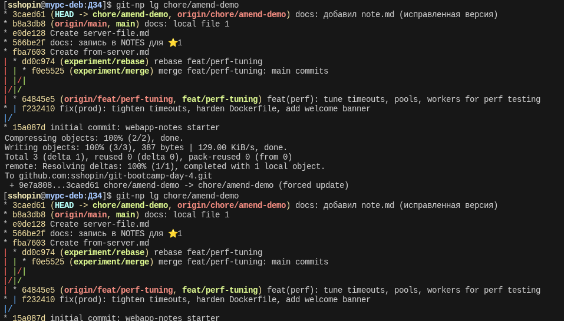
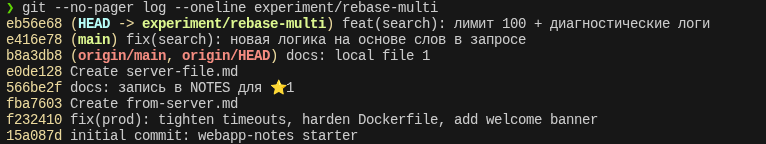
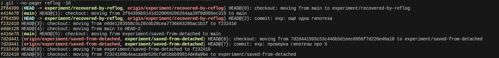

# LAB — день 4

> Это шаблон отчёта. Скопируйте его в `LAB.md` в корне вашего репозитория с ДЗ и заполните по ходу работы. Достаточно осмысленных заголовков, code-блоков с языком и ссылок на скриншоты.

Курс: [«Интенсив по погружению в GIT»](https://slurm.io/git-intensive)


## Базовая задача — `01-merge-vs-rebase`

### Стартовое состояние

Создана ветка `feat/perf-tuning`. В ветке `feat/perf-tuning` и `main` внесены и закомичены изменения в 4 файла: webapp/config.py webapp/services.py webapp/templates/index.html Dockerfile: одновременная настройка с противоположными целями одних и тех же функций. Обе ветки запущены в удаленный репозиторий.

```bash
# git log --oneline --graph --all (на момент окончания подготовки)
```



### Путь A — через `merge`

[FIXME:Что сделано на ветке `experiment/merge`, какой файл и через что разрешали (CLI или VS Code Merge Editor). Какие компромиссы выбрали и почему.]
Создана ветка `experiment/merge` от последнего коммита в main и переключились на неё. В ветку влита `feat/perf-tuning` в режиме `merge`. Получены конфликты в 4 измененных файлах. С помощью VSCode разрешен конфликт в `webapp/config.py` и `webapp/services.py`, `Dockerfile` и `webapp/templates/index.html` разрешены в nano. Приняты изменения из `feat/perf-tuning`.

```bash
# ключевые команды
 git switch -c experiment/merge
 git merge feat/perf-tuning
 git mergetool 

 git add Dockerfile webapp/templates/index.html
 git commit -m "merge feat/perf-tuning: main commits"
 
```





### Путь B — через `rebase`

Создана ветка `experiment/merge` от последнего коммита в main и переключились на неё. Влита ветка `feat/perf-tuning` в режиме rebase.

```
Auto-merging Dockerfile
CONFLICT (content): Merge conflict in Dockerfile
Auto-merging webapp/config.py
CONFLICT (content): Merge conflict in webapp/config.py
Auto-merging webapp/services.py
CONFLICT (content): Merge conflict in webapp/services.py
Auto-merging webapp/templates/index.html
CONFLICT (content): Merge conflict in webapp/templates/index.html
error: could not apply f232410... fix(prod): tighten timeouts, harden Dockerfile, add welcome banner
```

```bash
# ключевые команды
git switch main
git switch -c experiment/rebase
git rebase feat/perf-tuning
git mergetool
git log --merges --oneline experiment/rebase
git commit -am "rebase feat/perf-tuning"
```



### Сравнение

Финальная история всех веток рядом:



Что я заметил(а) в процессе сравнения:
- нет merge коммита в rebase, история линейная
- ветка `feat/perf-tuning` видна в истории как сущность

### Какой подход я бы выбрал(а) в команде и почему

Для обновления `main` - merge, чтобы видеть как велась работа. В линейной истории после rebase теряется контекст.
Для вливания в свою ветку изменений из `main` - rebase.


## Задания со звездочкой (опционально)
> это заполняете только если делали. иначе не включайте в отчет и удалите их шаблона

### ⭐1 — `git pull` vs `git pull --rebase`

Что было воспроизведено, какая разница в истории получилась, какую глобальную настройку поставили в `~/.gitconfig`.
Создана ситуация, когда ветка изменена и локально, и на сервере.
В результате при `git fetch`, `git status` видим, что ветки разошлись.
Глобальная настройка pull.rebaseне занада, в результате получаем:
```
$ git pull
hint: You have divergent branches and need to specify how to reconcile them.
hint: You can do so by running one of the following commands sometime before
hint: your next pull:
hint:
hint:   git config pull.rebase false  # merge
hint:   git config pull.rebase true   # rebase
hint:   git config pull.ff only       # fast-forward only
hint:
hint: You can replace "git config" with "git config --global" to set a default
hint: preference for all repositories. You can also pass --rebase, --no-rebase,
hint: or --ff-only on the command line to override the configured default per
hint: invocation.
fatal: Need to specify how to reconcile divergent branches.
```

Если сделать `git pull --merge`, то получаем ветвление, которое не всегда желательно - бессмыленный мусор в истории.
`git pull --rebase` переносит изменения с сервера и помещает локальный коммит на верх.
Для обеспечения этого поведения по умолчанию нужно изменить настройку конфигурации:
`git config --global pull.rebase true`.
Данное поведение по умолчанию применятся только на приватных ветках. **На публичных ветках rebase запрещен:** получается ситуация "отдай проблему соседу".
Опасность rebase на публичной ветке в том, что:
- переписывается история, которую кто-то мог увидеть
- другие разработчики при следующем pull --rebase тоже переписывают свои коммиты
- все коммиты меняют хеши → теряются ссылки, комментарии к PR, баг-трекеры
- у разных разработчиков оказываются разные версии "одних и тех же" коммитов



### ⭐2 — `--force-with-lease` vs `--force`

Сделано `git commit --amend` после push. Это изменило хеши коммита, в результате обычный `git push` отказал.

Варианты действий:
- `--force` - перезаписать историю в соответствии с локальной. **Применимо только на приватной ветке**

- `--force-with-lease` проверяет нет ли чужих изменений, и перезаписывает историю только в случае их отсутствия: "Я перезапишу удаленную ветку, НО только при условии, что она сейчас выглядит так, как я ожидаю (содержит тот коммит, который я видел в последний раз)"
При наличии удаленного коммита `--force-with-lease` выдаст ошибку

```
$ git push --force-with-lease
To github.com:sshopin/git-bootcamp-day-4.git
 ! [rejected]        chore/amend-demo -> chore/amend-demo (stale info)
error: failed to push some refs to 'github.com:sshopin/git-bootcamp-day-4.git'
```

- `--force-if-includes` проверяет содержит ли локальная ветка тот коммит, который сейчас лежит на сервере. Если работа базируется на старой версии и не включает в себя последний коммит с сервера, Git запретит пуш.

`--force-with-lease` чем  безопаснее `--force`, т.к. не даст затереть чужую работу (то, что кто-то ещё запушил в репозиторий)

Вывод `git push`:
```
$ git push
To github.com:sshopin/git-bootcamp-day-4.git
 ! [rejected]        chore/amend-demo -> chore/amend-demo (non-fast-forward)
error: failed to push some refs to 'github.com:sshopin/git-bootcamp-day-4.git'
hint: Updates were rejected because the tip of your current branch is behind
hint: its remote counterpart. If you want to integrate the remote changes,
hint: use 'git pull' before pushing again.
hint: See the 'Note about fast-forwards' in 'git push --help' for details.
```

Вывод `git push --force-with-lease`:
```
$ git push --force-with-lease
Enumerating objects: 4, done.
Counting objects: 100% (4/4), done.
Delta compression using up to 12 threads
Compressing objects: 100% (2/2), done.
Writing objects: 100% (3/3), 387 bytes | 129.00 KiB/s, done.
Total 3 (delta 1), reused 0 (delta 0), pack-reused 0 (from 0)
remote: Resolving deltas: 100% (1/1), completed with 1 local object.
To github.com:sshopin/git-bootcamp-day-4.git
 + 9e7a808...3caed61 chore/amend-demo -> chore/amend-demo (forced update)
 ```



### ⭐3 — rebase с конфликтом на каждом коммите

Создана ветка `experiment/rebase-multi`.
Коммиты, вносящие исправление в код, с существенно изменяющимся смыслом:
- experiment/rebase-multi: feat(search): пересмотрены веса scoring
- experiment/rebase-multi: feat(search): лимит 100 + диагностические логи"
- main: fix(search): новая логика на основе слов в запросе

В ветке `experiment/rebase-multi` сделан `git rebase main`. Получены конфликты.
Выполнено два `--continue`. Приняты исправления из main, т.к. логика полностью изменена и первый коммит потерял смысл. Из второго коммита оставлен только лог.



### ⭐4 — безопасный выход из detached HEAD

Зашли в detached HEAD с помощью
```bash
git checkout f232410
# или
git switch --detached f232410
```

```bash
# git checkout f232410
Note: switching to 'f232410'.

You are in 'detached HEAD' state. You can look around, make experimental
changes and commit them, and you can discard any commits you make in this
state without impacting any branches by switching back to a branch.

If you want to create a new branch to retain commits you create, you may
do so (now or later) by using -c with the switch command. Example:

  git switch -c <new-branch-name>

Or undo this operation with:

  git switch -

Turn off this advice by setting config variable advice.detachedHead to false

HEAD is now at f232410 fix(prod): tighten timeouts, harden Dockerfile, add welcome banner

# git status
HEAD detached at f232410
```

#### Вариант 1
Сделан коммит с файлом `experiment.md`: 'exp: проверка гипотезы про X'

Вышли с помощью создания ветки `experiment/saved-from-detached`:
```bash
# git switch -c experiment/saved-from-detached

# git --no-pager log --oneline
7d2d441 (HEAD -> experiment/saved-from-detached) exp: проверка гипотезы про X
f232410 fix(prod): tighten timeouts, harden Dockerfile, add welcome banner
15a087d initial commit: webapp-notes starter
```

#### Вариант 2
Ситуация - забытый коммит.

Зашли аналогично варианту 2. Сделали коммит с файлов experiment2.md: "exp: ещё одна гипотеза".
Переключились на ветку main:
```bash
❯ git switch main
Warning: you are leaving 1 commit behind, not connected to
any of your branches:

  2f84399 exp: ещё одна гипотеза

If you want to keep it by creating a new branch, this may be a good time
to do so with:

 git branch <new-branch-name> 2f84399

Switched to branch 'main'
Your branch is ahead of 'origin/main' by 1 commit.
  (use "git push" to publish your local commits)
```

С помощью git reflog нашли зависший хеш зависшего коммита 2f84399 по тексту: 
```
2f84399 HEAD@{2}: commit: exp: ещё одна гипотеза
```

Создали ветку по хешу коммита:
```bash
❯ git switch -c experiment/recovered-by-reflog 2f84399
Switched to a new branch 'experiment/recovered-by-reflog'
```


Как зашли в detached HEAD, какой коммит сделали, как выходили через `git switch -c`, чем `git reflog` помог как страховка.



